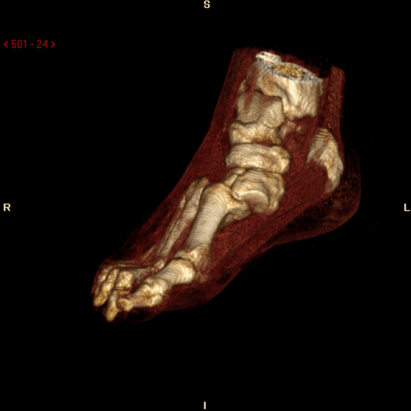
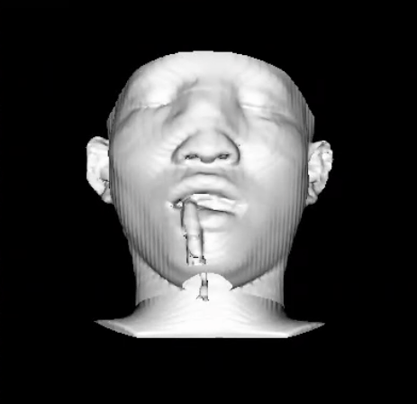

 # Medical Visualization

## Solution Steps

- [Medical Visualization](#medical-visualization)
  - [Solution Steps](#solution-steps)
  - [Creating the GUI](#creating-the-gui)
  - [Loading the Data](#loading-the-data)
  - [Editing the ISO Value](#editing-the-iso-value)
  - [Editing the Transfer Function](#editing-the-transfer-function)
  - [Project Structure](#project-structure)
  - [Issues](#issues)
    - [Issue-1](#issue-1)
    - [Issue-2](#issue-2)
    - [Issue-3](#issue-3)


## Creating the GUI
 



the GUI contains the following funcitonality

- open new instance of the program, either by clicking on File > New, or by pressing the shourtcut (CTRL+N)

- open a dataset folder, either by clicking on File > Open, or by pressing the sourtcut (CTRL+O)

- exit the current instance of the gui, either by pressing File > Exit, or by pressing the shourtcut (CTRL+Q)

- A combobox for choosing which rendering technique to use from two different types (surface rendering, and ray casting rendering)

- a slider for controlling the ISO value in the surface rendering mode

- a slider package to change the rgba in the ray casting rendering mode

- two buttons for reseting the defaults for either of the two rendering modes

## Loading the Data

We used a function called **getExistingDirectory** from a QtWidget called **QFileDialog** that function returns the path to the directory containing the dataset.

```python
def load_data(self):
        self.dataDir = QtWidgets.QFileDialog.getExistingDirectory(None,"Load Data", "./", QtWidgets.QFileDialog.ShowDirsOnly
                                             | QtWidgets.QFileDialog.DontResolveSymlinks )
```

if the user input is invalid i.e. he quits instead of choosing a directory, the program won't crash

The we used a class from the vtk package called vtkDICOMImageReader which contains a method called **SetDirectoryName** which lists the directory files for data loading

```python
reader = vtk.vtkDICOMImageReader()
reader.SetDirectoryName(dataDir)
reader.Update()
```

-   [Issue 1](#issue-1)

## Editing the ISO Value

We created a Signal for the Slider Released, which is then called upon the mouse release

this function is called update_iso, this function takes the value of the slider and the current mode of rendering

if and only if the function is called and the current rendering mode is surface rendering, it will update the iso value and then update the scene

```python
def update_iso(val: int, current_rendering_technique: Technique) -> None:
    if current_rendering_technique == Technique.SurfaceRendering.value:
        surfaceExtractor.SetValue(0, val)
        iren.update()
```

## Editing the Transfer Function

We created two Signals for the Slider Released for both the RGB and opacity values, which is then called upon the mouse release

both of them takes the node and values of RGB or a (opacity)

they first delete the existing point at this node and recreate it with the new values and then update the scene

```python
def update_rgb(node: int, R: float, G: float, B: float) -> None:
    volumeColor.RemovePoint(node)
    volumeColor.AddRGBPoint(node, R, G, B)
    iren.update()

def update_opacity(node: int, opacity: float) -> None:
    volumeColor.RemovePoint(node)
    volumeScalarOpacity.AddPoint(node, opacity)
    iren.update()
```

- [Issue-2](#issue-2)

## Project Structure

- RenderingType.py
    
    This file contains an Enum Class with two values indicating the two different modes of operation

- constants.py

    This file contains the literal integers used in the calculations, just for the sake of readability and clean coding

- rendering.py

    This file contains all of vtk methods that are responsible for creating the window scene and updating ISO, RGB and opacity

- app.py

    This file contains the main window of the application

- ui_Main.py

    This file contains the compiled ui components

- GUI.ui

    This file contains the XML version of the GUI

## Issues

while creating the project we faced some problems and decided to drop some features that would've took forever to implement

### Issue-1

If the user chose a wrong directory, i.e. one that does not contain any DICOM Images, the program would through an error.

the problem is that it happens internally inside the vtk package, i.e. it does not through an exception to wrap a try except block arround

### Issue-2

for the Values of the Transfer funciton sliders, the labels should indicate a value between 0 and 1 i.e. the value of the slider divided by 100

the problem is that the slider does not take floating point numbers, and it would've taken a lot of time and lines of code just to map the values and create connection between the slider and the labels

so we decided to just let it as is from 0 to 100 just like the value of the slider

### Issue-3

The Sliders for Ray Casting Rendering should be disabled on the Surface mode and vice versa, but again, it would take a lot of time

## Contributors 
- Ramadan Ibrahim
- Mohamed Abdelaziz 
- Mohamed Seyam
