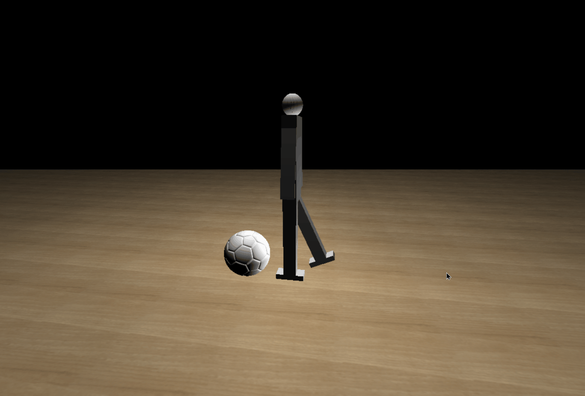

# Texture Mapping, Object Loading and Animation


## Solution Steps

-   [Create Floor](#create-floor)
-   [Changing Floor Texture](#changing-floor-texture)
-   [Place Robot on the floor](#place-robot-on-the-floor)
-   [Add Another Object](#add-another-object)
-   [Add Interaction Animation](#add-interaction-animation)
-   [Issues](#issues)


## Create Floor


```c++

            void draw_ground() {
                glPushMatrix();
                glLightfv(GL_LIGHT1, GL_POSITION, lightPos1);
                glLightfv(GL_LIGHT0, GL_POSITION, light_position);
                glPopMatrix();
                glPushMatrix();
                glEnable(GL_TEXTURE_2D);
                glBindTexture(GL_TEXTURE_2D, _textureId);
                glTexParameteri(GL_TEXTURE_2D, GL_TEXTURE_MIN_FILTER, GL_LINEAR);
                glTexParameteri(GL_TEXTURE_2D, GL_TEXTURE_MAG_FILTER, GL_LINEAR);
                glBegin(GL_QUADS);
                glNormal3f(0.0f, 1.0f, 0.0f);
                for (int z = 0; z < 20; z++) {
                    float zStart = 100.0f - z * 10.0f;
                    for (int x = 0; x < 20; x++) {
                        float xStart = x * 10.0f - 100.0f;

                        glTexCoord2f(0.0f, 0.0f);  glVertex3f(xStart, -5.0f, zStart);
                        glTexCoord2f(3.0f, 0.0f);  glVertex3f(xStart + 10.0f, -5.0f, zStart);
                        glTexCoord2f(3.0f, 3.0f);  glVertex3f(xStart + 10.0f, -5.0f, zStart - 10.0f);
                        glTexCoord2f(0.0f, 3.0f);  glVertex3f(xStart, -5.0f, zStart - 10.0f);
                    }
                }

                glEnd();
                glDisable(GL_TEXTURE_2D);
                glPopMatrix();
            }
```
## Changing Floor Texture
``` c++
void screen_menu(int value)
{

    switch (value)
    {
    case '1':
        groundname = "images/floor.bmp";
        std::cout << groundname << std::endl;
        initRendering();

        break;
    case '2':
        groundname = "images/wood.bmp";
        std::cout << groundname << std::endl;
        initRendering();
        break;
    case '3':
        groundname = "images/buz.bmp";
        std::cout << groundname << std::endl;
        initRendering();
        break;
    }

    reset();
    glutPostRedisplay();
}
```
## Place Robot on the Floor


## Add Another Object
``` c++
void drawmodel(char* filename)
{
    GLMmodel* model = glmReadOBJ(filename);
    glmUnitize(model);
    glmFacetNormals(model);
    glmVertexNormals(model, 90.0);
    glmScale(model, .15);
    glmDraw(model, GLM_SMOOTH | GLM_MATERIAL);
}
```

## Add Interaction Animation
```C++
void timer(int value) {
    f = f % 5;
    setposes(f);
    f++;
    glutPostRedisplay();
    glutTimerFunc(150, timer, 0);
}
```
```c++
void setposes(int frameNum) {
    LeftShoulderX = poses[frameNum][0];
    LeftShoulderY = poses[frameNum][1];
    LeftShoulderZ = poses[frameNum][2];
    RightShoulderX = poses[frameNum][3];
    RightShoulderY = poses[frameNum][4];
    RightShoulderZ = poses[frameNum][5];
    LeftElbow = poses[frameNum][6];
    RightElbow = poses[frameNum][7];
    LeftUpperLegX = poses[frameNum][8];
    LeftUpperLegZ = poses[frameNum][9];
    LeftLowerLeg = poses[frameNum][10];
    RightUpperLegX = poses[frameNum][11];
    RightUpperLegZ = poses[frameNum][12];
    RightLowerLeg = poses[frameNum][13];
}
```
## Issues

### issue       ---------------------------
*        synchoronizing the motion off the object with the motion of the robot 

### solving --------------------------

define  

``` c++ 
BallForward = 2.4 , BallUp = -4; 
```
and use them in setposes function 
```c++ 
    BallForward = poses[frameNum][14];
    BallUp = poses[frameNum][15];

```

